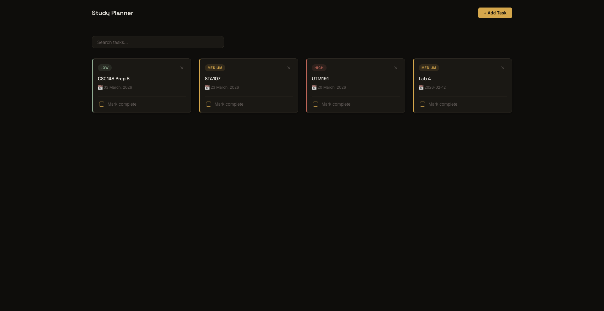
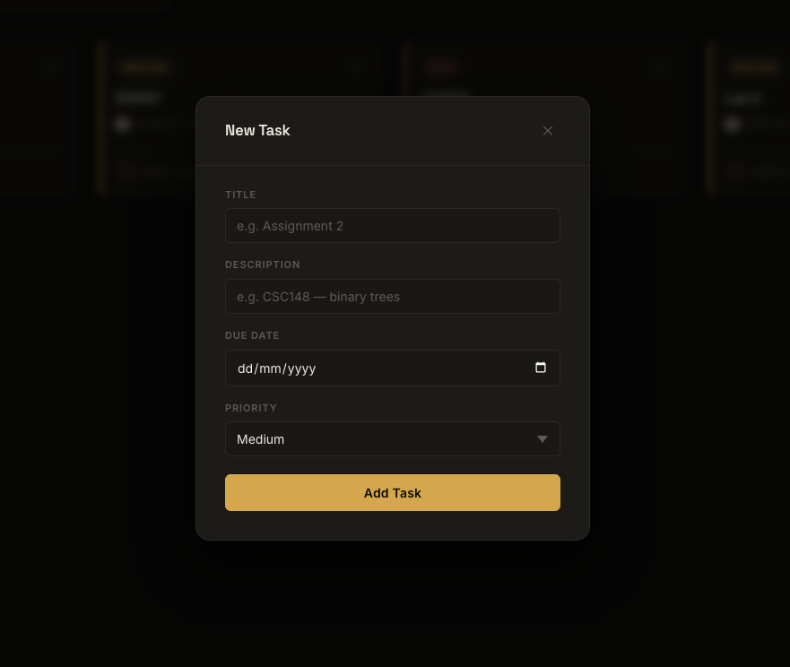

# Study Planner

A full-stack study planning app that lets you create, organize, and track tasks by due date and priority. It is built to help students stay on top of coursework without the overhead of a heavyweight project management tool.

<!-- TODO: 2-3 sentences here. Who is this for, what problem does it solve, what makes it useful day-to-day? -->
The study planner is for students in school or university finding a way to list down their tasks with priorities and completed status 
all in one accessible place. Since it works and displays properly on any kind of device, the students can view their tasks on mobile 
too, making it convenient when the desktop is not available.

## Features

- Create, edit, delete, and mark tasks as complete
- Search tasks by title
- Responsive layout (mobile-friendly)
- Dark, warm UI with a custom design system

<!-- TODO: trim/adjust this list once Phase 4 sorting + overdue highlighting are confirmed done -->

## Tech Stack

**Frontend:** React (Vite), JavaScript, HTML, CSS
**Backend:** FastAPI, SQLModel, SQLite
**Tooling:** GitHub for version control

## FAST-API Endpoints

| Method | Endpoint            | Description              |
|--------|----------------------|---------------------------|
| GET    | `/tasks`             | Get all tasks             |
| POST   | `/tasks`              | Create a new task         |
| PATCH  | `/tasks/{id}`         | Update a task             |
| DELETE | `/tasks/{id}`         | Delete a task             |

## Getting Started

### Backend

```bash
cd backend
python -m venv venv
source venv/bin/activate   # on Windows: venv\Scripts\activate
pip install -r requirements.txt
uvicorn main:app --reload
```

The API will be running at `http://127.0.0.1:8000`, with interactive docs at `http://127.0.0.1:8000/docs`.

### Frontend

```bash
cd frontend
npm install
npm run dev
```

The app will be running at `http://localhost:5173`.

## Screenshots

### Home Page


### Add Task Form


## Roadmap

Stage 1 (current): core CRUD, frontend-backend integration, and UI polish.

Stage 2 (next):
<!-- TODO: list planned stage 2 features here, e.g. user authentication, categories/tags, recurring tasks, calendar view, deployment -->
- Sort tasks by due date and priority
- Accumulate completed and non-completed tasks in two separate areas
- Overdue tasks highlighted in red
- User authentication

## Project Status

Stage 1 complete. Actively developing stage 2 features.