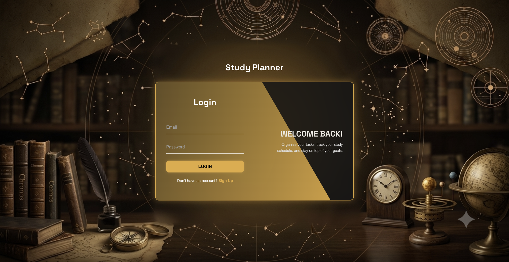
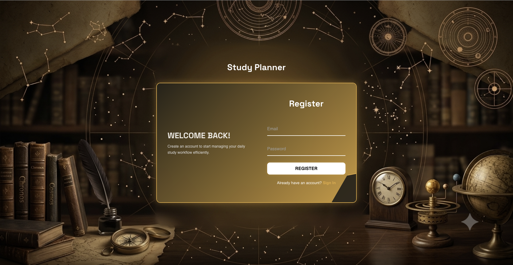
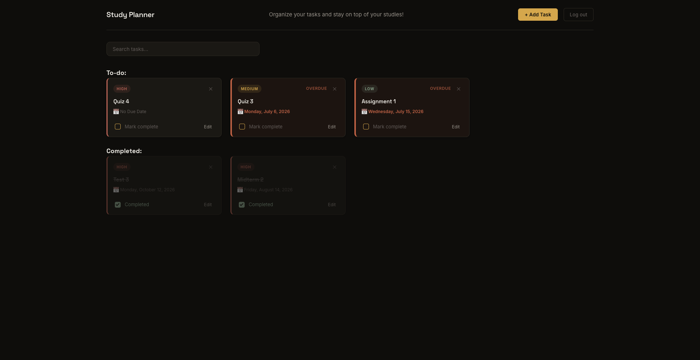
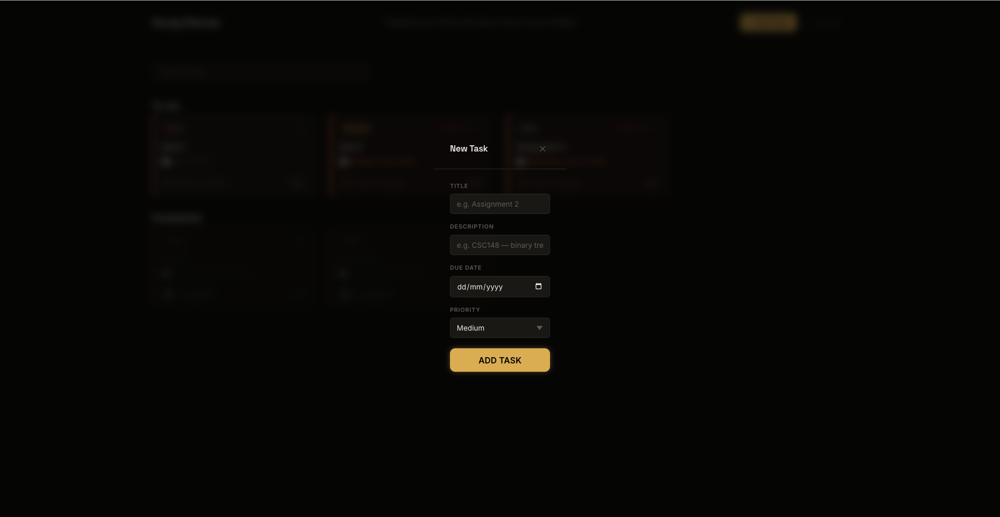

# Study Planner

A full-stack study planning app that lets you create, organize, and track tasks by due date and priority. It is built to help students stay on top of coursework without the overhead of a heavyweight project management tool.

<!-- TODO: 2-3 sentences here. Who is this for, what problem does it solve, what makes it useful day-to-day? -->
The study planner is for students in school or university finding a way to list down their tasks with priorities and completed status 
all in one accessible place. Each user has its own private workspace to display their own task list.

## Features
- **User Authentication & Personalization:** Secure individual accounts ensuring each student accesses and manages their own private workspace.
- **Task Categorization & Prioritization:** Ability to assign priority levels, due dates, tags, and subject categories to keep coursework organized.
- **Status Tracking:** Real-time progress updates that allow users to mark tasks as pending, or finished. Overdue tasks highlighted in red
- **Interactive Dashboard:** A centralized, clean overview displaying upcoming deadlines, high-priority tasks, and overall completion statistics.
- **Search & Filter Functionality:** Quick searching options to view tasks based on their title.


## Tech Stack

**Frontend:** React (Vite), JavaScript, HTML, CSS
**Backend:** FastAPI, SQLModel, SQLite
**Tooling:** GitHub for version control

## FAST-API Endpoints

| Method | Endpoint            | Description              |
|--------|----------------------|---------------------------|
| GET    | `/tasks`             | Get all tasks             |
| POST   | `/tasks`              | Create a new task         |
| PATCH  | `/tasks/{id}`         | Update a task             |
| DELETE | `/tasks/{id}`         | Delete a task             |

## Getting Started

### Backend

```bash
cd backend
python -m venv venv
source venv/bin/activate   # on Windows: venv\Scripts\activate
pip install -r requirements.txt
uvicorn main:app --reload
```

The API will be running at `http://127.0.0.1:8000`, with interactive docs at `http://127.0.0.1:8000/docs`.

### Frontend

```bash
cd frontend
npm install
npm run dev
```

The app will be running at `http://localhost:5173`.

## Screenshots

### User Authentication Forms
#### Log-in


#### Register


### Home Page


### Add Task Form


## Roadmap

Stage 1: core CRUD, frontend-backend integration, and UI polish.

Stage 2 (completed):
- User authentication

Stage 2 (next):
<!-- TODO: list planned stage 2 features here, e.g. categories/tags/filter, recurring tasks, calendar view, deployment -->
- AI Recommendation system

## Project Status

Stage 1 and part 1 of stage 2 complete. Actively developing stage 2's next features.