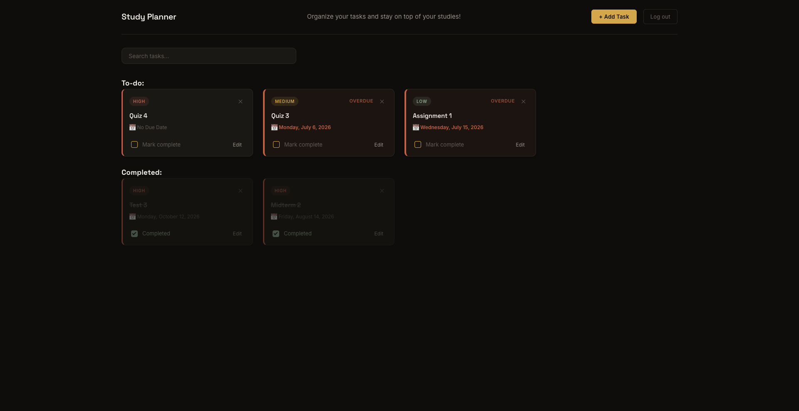
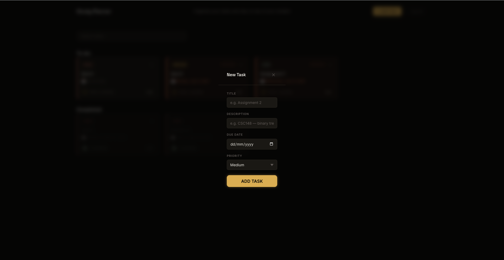
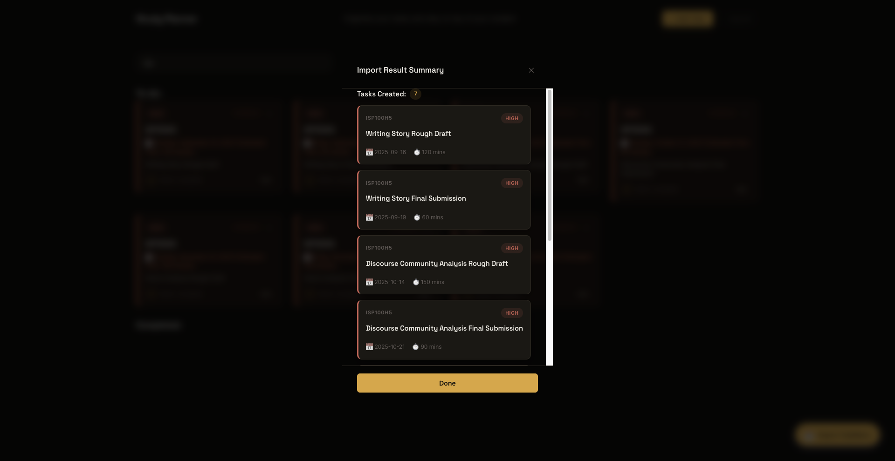

# Study Planner

A full-stack study planning app that lets you create, organize, and track tasks by due date and priority. It is built to help students stay on top of coursework without the overhead of a heavyweight project management tool.

<!-- TODO: 2-3 sentences here. Who is this for, what problem does it solve, what makes it useful day-to-day? -->
The study planner is for students in school or university finding a way to list down their tasks with priorities and completed status 
all in one accessible place. Each user has its own private workspace to display their own task list.

## Features
- **User Authentication & Personalization:** Secure individual accounts ensuring each student accesses and manages their own private workspace.
- **Task Categorization & Prioritization:** Ability to assign priority levels, due dates, tags, and subject categories to keep coursework organized.
- **Status Tracking:** Real-time progress updates that allow users to mark tasks as pending, or finished. Overdue tasks highlighted in red
- **Interactive Dashboard:** A centralized, clean overview displaying upcoming deadlines, high-priority tasks, and overall completion statistics.
- **Search & Filter Functionality:** Quick searching options to view tasks based on their title.
- **Import Syllabus:** Import a syllabus to extract all assignments and create all task cards automatically.


## Tech Stack

**Frontend:** React (Vite), JavaScript, HTML, CSS
**Backend:** FastAPI, SQLModel, SQLite
**Tooling:** GitHub for version control

## FAST-API Endpoints

| Method | Endpoint            | Description              |
|--------|----------------------|---------------------------|
| GET    | `/tasks`             | Get all tasks             |
| POST   | `/tasks`              | Create a new task         |
| PATCH  | `/tasks/{id}`         | Update a task             |
| DELETE | `/tasks/{id}`         | Delete a task             |

## Getting Started

### Backend

```bash
cd backend
python -m venv venv
source venv/bin/activate   # on Windows: venv\Scripts\activate
pip install -r requirements.txt
uvicorn main:app --reload
```

The API will be running at `http://127.0.0.1:8000`, with interactive docs at `http://127.0.0.1:8000/docs`.

### Frontend

```bash
cd frontend
npm install
npm run dev
```

The app will be running at `http://localhost:5173`.

## Screenshots

### User Authentication Forms
#### Log-in


#### Register


### Home Page


### Add Task Form


### Import Syllabus Summary


## Design Decisions & Technical Tradeoffs

### Syllabus Import Feature:
#### Priority computed in Python, not by the LLM
Initially asked Claude to classify each item's priority directly. Testing against the real MAT135 grading breakdown showed Claude getting the arithmetic wrong on two categories (dividing category weight by item count) which is a predictable failure mode, since precise arithmetic embedded in natural-language instructions is not a strength of LLMs. Redesigned so Claude only reports each category's stated percentage (a transcription task it handles reliably), while Python performs the division and threshold comparison deterministically. This also made the logic unit-testable and debuggable in a way "trust the model's math" never could be.

#### Dropped table-specific PDF parsing (pdfplumber.extract_tables()) in favor of full-document text extraction using LLM
The original implementation searched for a "Marking Scheme" header and extracted only detected table structures. Testing against syllabi from other courses and universities revealed this approach doesn't generalize: different institutions use different section headers ("Grading Breakdown," "Assessment, Evaluation, and Grading"), and some syllabi present grading information as prose rather than tables at all. Replaced with unconditional full-text extraction, delegating the "find the relevant section regardless of formatting" problem to the LLM — a better fit for its strengths than brittle string-matching and layout detection.

#### Partial-success validation instead of all-or-nothing
Each extracted item is validated independently against the TaskCreate schema; a single malformed item (bad date format, unresolvable category) is skipped with a recorded reason rather than discarding the entire import batch. Reflects a deliberate choice to trust LLM output only as far as its worst-performing item, not its average.

## Known Limitations

### Syllabus Import Feature:
#### No duplicate-import detection
Uploading the same syllabus twice creates two full sets of duplicate task cards. There's currently no check against existing tasks (by course + description + due date, or similar) before inserting. Acceptable for now since imports are infrequent and user-initiated.

#### No handling for scanned (non-text) PDFs
PDF text extraction assumes a genuine text layer exists. A scanned/photographed PDF with no selectable text would extract as empty or near-empty content, and the pipeline has no fallback (e.g. treating it as an image, or applying OCR) for that case. None of the syllabi tested so far were scanned documents, so this hasn't been hit in practice.

#### No pre-commit confirmation step
Extracted tasks are validated and inserted into the database in a single step; the post-import summary modal is informational only, shown after tasks already exist. There's no way to review and reject specific items before they're created. A rejected/unwanted card must be deleted manually afterward like any other task.

## Roadmap

Stage 1: core CRUD, frontend-backend integration, and UI polish.

Stage 2 (completed):
- User authentication
- AI Recommendation system

## Project Status

Stage 1 and stage 2 complete. Will add more features.